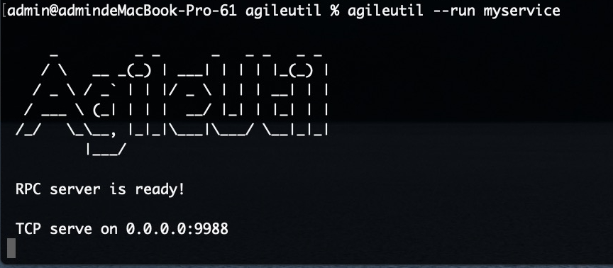

## 快速开始
myservice.py:
```Python hl_lines="2"
from pyx.rpc.server import rpc

@rpc
def add(n1, n2):
    return n1 + n2
```
启动：
```shell
pyx --run myservice
```



请求
```
from pyx.rpc.client import TcpRpcClient

cli = TcpRpcClient('127.0.0.1', 9988, timeout=10)
res = cli.add(1, 2)
print(res)
``` 

[文档](./DETAIL.md)