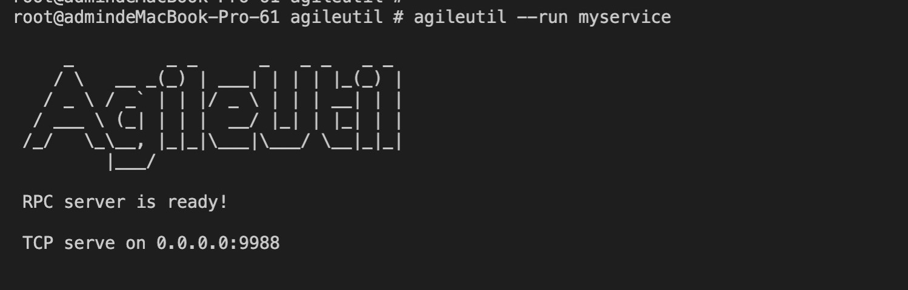

## 快速开始
myservice.py
```python
from agileutil.rpc.server import rpc

@rpc
def add(n1, n2):
    return n1 + n2
```
启动：
```shell
agileutil --run myservice
```



请求
```
from agileutil.rpc.client import TcpRpcClient

cli = TcpRpcClient('127.0.0.1', 9988, timeout=100000)
res = cli.add(1, 2
print(res)
```

[文档](./DETAIL.md)